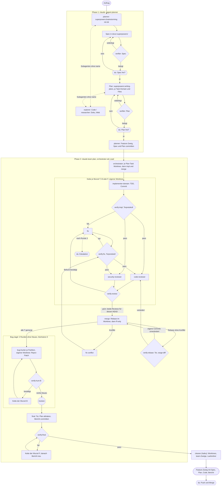

# Agent-Team: Planer, Orchestrator und Rollen als Graph-Loop

Stand: 2026-10-08, dritte Fassung nach zwei verifier-Läufen.
Status: Entwurf zur Freigabe. Die Entscheidungen des Nutzers stehen in
Abschnitt 14.

## 1. Ziel

Ein Agenten-Gespann für Software Engineering mit Konzernanspruch: Ein Auftrag
in Prosa wird zu einem PR-reifen Zweig, über mehrere Reviews, Security-Prüfung,
eine Bug-Jagd und einen Prüfer, der jede Aussage zu widerlegen versucht und das
Überlebende mit Daten belegt.

Was der Nutzer festgelegt hat:

- Ablage persönlich und global unter `~/.claude/`; eine spätere Übernahme in
  loomux ist möglich, aber nicht Teil dieser Spec.
- Ein Lauf geht vom Auftrag bis zum PR-reifen Zweig. Der Mensch gibt Spec und
  Plan frei; danach läuft der Loop autonom. Push und Merge bleiben beim
  Menschen.
- Getrieben wird der Graph als **Agent-Team** (Claude Code, experimentell), der
  Orchestrator ist der Lead.
- Spec und Plan entstehen mit superpowers; die Tasks des Plans sind die
  Status-Quelle, der Orchestrator verteilt sie.
- Hinter jedem Schritt steht der verifier.
- Code- und Security-Review müssen grün sein, bevor etwas auf den
  Feature-Zweig kommt.
- Parallele Implementer bekommen je einen eigenen Worktree; nach dem Lauf ist
  alles aufgeräumt.
- Modelle und Effort nach CursorBench 4.0 (Abschnitt 3).

### Nicht-Ziele

- Keine Integration in loomux (`flow.toml`, `loomux init`).
- Keine Split-Panes: unter Windows gibt es nur den In-process-Modus.
- Kein Bau über `claude -p` oder das Agent SDK: dort spawnt Claude Code keine
  Teammates.
- Keine verschachtelten Teams: nur der Lead spawnt Teammates.

## 2. Grundlagen aus der Doku

Gelesen am 2026-10-08 auf `code.claude.com/docs/en/` (`agent-teams`,
`sub-agents`, `hooks`, `workflows`, `tools-reference`, `permission-modes`).
Was das Design trägt:

1. **Team-Schalter.** `CLAUDE_CODE_EXPERIMENTAL_AGENT_TEAMS=1` schaltet Teams
   ein. Dann startet jeder Agent-Aufruf mit `name` als Teammate, außer einem
   Fork, einem Aufruf mit `isolation` und in `-p`-/SDK-Sitzungen. Eine `0` in
   den User-Settings überstimmt einen Shell-Export; einschalten lässt es sich
   dann nur über eine Settings-Quelle höherer Priorität, etwa `--settings`.
2. **Task-Werkzeuge.** `TaskCreate`, `TaskGet`, `TaskList` und `TaskUpdate`
   gibt es standardmäßig nur auf Claude 3.x, Opus 4–4.7, Sonnet 4–4.6 und
   Haiku 4.5. Auf den 5er-Modellen fehlen sie ohne Opt-in
   (`CLAUDE_CODE_ENABLE_TODO_TOOLS=1`, `--allowedTools` oder `--tools`). Ohne
   sie feuert `TaskCreated` nicht, und ein In-process-Teammate hat sie nur,
   wenn die Sitzung des Leads sie hat.
3. **Definitionen für Teammates.** In-process gelten `tools`, `model`,
   `disallowedTools`, `effort` und der Rumpf (an den Standard-Prompt
   angehängt). `skills` gilt nie, `mcpServers` in-process nicht. Ein Teammate
   lädt die Skills aus User- und Projekteinstellungen und ruft sie über das
   Werkzeug `Skill` auf. Ein Modell im Spawn-Prompt hat Vorrang vor `model`
   der Definition; `CLAUDE_CODE_SUBAGENT_MODEL_FORCE=1` setzt beides außer
   Kraft. `CLAUDE_CODE_EFFORT_LEVEL` überstimmt `effort` der Definition.
4. **Hauptsitzung als Agent.** `claude --agent <name>` übernimmt Werkzeuge und
   Modell der Definition, ihr Rumpf **ersetzt** den System-Prompt ganz.
   `CLAUDE.md` lädt weiter.
5. **`AskUserQuestion`** wird jedem Subagenten entzogen. Ob es unter `--agent`
   in der Hauptsitzung bleibt, sagt die Doku nicht (Rauchtest 5).
6. **Herkunft der Definitionen.** `~/.claude/agents/` (Priorität 4) ist als
   Quelle für Teammates ausdrücklich genannt.
7. **Rechte.** Teammates erben den Modus des Leads, außer `dontAsk`; nach dem
   Spawn lässt er sich je Teammate ändern. Ihre Rechte-Prompts landen beim
   Lead.
8. **Geschützte Pfade.** Schreiben unter `.claude` wird nie automatisch
   freigegeben, außer in `bypassPermissions`. Ausnahmen sind unter anderem
   Claudes eigene Worktrees unter `.claude/worktrees/`. Allow-Regeln heben das
   nicht auf.
9. **Hooks.** `TaskCreated` (Exit 2 rollt die Anlage zurück), `TaskCompleted`
   (Exit 2 verhindert das Abschließen; feuert auch, wenn ein Teammate seinen
   Zug mit Tasks in Arbeit beendet), `TeammateIdle`. Keiner kennt Matcher.
   `TaskCreated`/`TaskCompleted` bekommen `task_id`, `task_subject`, optional
   `task_description` und `teammate_name`, dazu wie jeder Hook `session_id` und
   `cwd`. Ein Hook, der in den Timeout läuft oder anders als mit 0 oder 2
   endet, blockiert nicht. Die Hooks-Doku nennt als Quellen User-, Projekt-,
   lokale, Managed- und Plugin-Settings sowie Frontmatter; dass auch eine per
   `--settings` geladene Datei Hooks trägt, ist naheliegend, aber nicht
   gelesen (Rauchtest 4).
12. **Zusätzliche Werkzeuge für Teammates.** Jeder In-process-Teammate bekommt
    `SendMessage` und, in einer Sitzung mit Task-Werkzeugen, `TaskCreate`,
    `TaskGet`, `TaskList` und `TaskUpdate`, unabhängig von `tools` und
    `disallowedTools` seiner Definition.
10. **Grenzen.** `/resume` holt keine In-process-Teammates zurück; ein Team je
    Sitzung; der Task-Status kann hinterherhinken; Hintergrund-Subagenten aus
    Teammates schlagen fehl. Ein Teammate, das per `SendMessage` angeschrieben
    wird, aber nicht mehr läuft, wird in derselben Sitzung samt Gespräch
    wiederbelebt.
11. **git 2.56** (Release 2026-09-28) bringt `git branch --delete-merged
    <upstream-muster> [<zweig-muster>…]` mit `--dry-run`: Es löscht lokale
    Zweige, die in ihren Upstream gemergt sind, und überspringt ausgecheckte
    Zweige.

## 3. Rollen

Dreizehn Definitionen unter `~/.claude/agents/<name>.md`. Rümpfe und
Beschreibungen sind englisch (sie instruieren ein LLM). Die Werkzeugspalte
nennt, was die Definition festlegt; als Teammate kommen `SendMessage` und die
Task-Werkzeuge immer dazu (Abschnitt 2, Punkt 12). Darüber schließen auch
cleaner und Reviewer ihre Tasks ab und melden sich beim Lead.

| Rolle | Läuft als | Modell | Effort | Werkzeuge | Skills (im Rumpf genannt) |
|---|---|---|---|---|---|
| `planner` | Hauptsitzung, `claude --agent planner` | opus | high | Read, Grep, Glob, Bash, Write, Edit, Agent, Skill, AskUserQuestion | `superpowers:brainstorming`, `superpowers:writing-plans` |
| `orchestrator` | Hauptsitzung und Lead, über `claude-team` | opus | medium | Read, Grep, Glob, Bash, Write, Edit, Agent, SendMessage, TaskCreate, TaskGet, TaskList, TaskUpdate, Skill, AskUserQuestion | — |
| `explorer` | Subagent oder Teammate | haiku | high | Read, Grep, Glob | — |
| `researcher` | Subagent oder Teammate | sonnet | high | Read, Grep, Glob, WebSearch, WebFetch | — |
| `implementer-infra` | Teammate | sonnet | xhigh | Read, Grep, Glob, Edit, Write, Bash, Skill | `superpowers:test-driven-development`, `superpowers:verification-before-completion` |
| `implementer-backend` | Teammate | sonnet | xhigh | wie oben | wie oben |
| `implementer-frontend` | Teammate | sonnet | xhigh | wie oben | wie oben |
| `implementer-ux` | Teammate | sonnet | xhigh | wie oben | wie oben |
| `code-reviewer` | Teammate | opus | medium | Read, Grep, Glob, Bash, Write, Skill | `superpowers:receiving-code-review` |
| `security-reviewer` | Teammate | opus | high | Read, Grep, Glob, Bash, Write, Skill | `vulnhunt`, `security-review` |
| `bug-hunter` | Teammate | opus | high | Read, Grep, Glob, Bash, Write, Skill | `vulnhunt` |
| `verifier` | Subagent (Phase 1) oder Teammate (Phase 2) | opus | high | Read, Grep, Glob, Bash, Write | — |
| `cleaner` | Teammate; bei `-Cleanup` Hauptsitzung über `claude -p` | haiku | high | Read, Glob, Bash | — |

Aufgaben:

- **planner**: Brainstorming mit dem Menschen, Spec, Plan. Spawnt `explorer`
  und `researcher` als Subagenten, schon während des Brainstormings, und
  `verifier` nach Spec und Plan. Jeder Plan-Task trägt zusätzlich zu den
  Feldern von writing-plans eine Zeile `**Domain:** infra|backend|frontend|ux`.
  Legt den Feature-Zweig an und committet Spec und Plan darauf.
- **orchestrator**: Verwaltet den Plan, legt Worktrees und Team-Tasks an,
  verteilt sie, holt fertige Zweige auf den Feature-Zweig, vergibt die
  Bug-Nummern `Bn`, eskaliert und prüft am Ende selbst. Schreibt keinen
  Produktcode; `Write` und `Edit` braucht er für `report.md` und die
  Plan-Checkboxen im `final`-Schritt. Nennt im Spawn-Prompt nie ein Modell und
  übergibt nie `isolation` (beides hebelte die Rollendefinition aus). Nennt
  jedem Teammate im Spawn-Prompt Lauf, Generation (Abschnitt 5) und Worktree.
- **explorer**: Code suchen und zusammenfassen, mit Datei:Zeile.
- **researcher**: Doku, Web, externe Quellen, mit URL.
- **implementer-\***: Ein Task je Auftrag, TDD, RED gegen den Stand davor,
  Commit im eigenen Worktree. Bei einem Bug-Fix ist der erste Schritt, den
  Repro-Test des Jägers einzuspielen (RED).
- **code-reviewer**: Review des Wurzel-Diffs gegen Spec und Plan:
  Korrektheit, Spec-Treue, Tests, Lesbarkeit.
- **security-reviewer**: Security-Review des Wurzel-Diffs.
- **bug-hunter**: Sucht nach dem Bau über den ganzen Feature-Zweig nach Bugs
  und Exploits, je Partition in einem eigenen Worktree; jeder Fund mit rotem,
  ausführbarem Repro-Test als Patch.
- **verifier**: Versucht jede Aussage zu widerlegen (Spec, Plan,
  Implementer-Nachweise, Review-Befunde, Funde, Fixes, Rebase, final) und
  belegt das Überlebende mit Daten: Befehl plus Ausgabe. Ohne Probe gibt es
  kein „bestätigt“. Fährt bei `verify:impl`, `verify:fix` und `verify:rebase`
  das Tor des Projekts selbst und schreibt das Torprotokoll (Abschnitt 6).
- **cleaner**: Räumt nach dem Lauf auf (Abschnitt 8) und meldet, was er nicht
  ohne Zwang entfernen kann.

**Der Hauptbaum ist für alle Teammates nur lesbar.** Geschrieben wird nur in
Worktrees und in den Ordnern `verdicts/` und `evidence/` des Laufs; der
Orchestrator schreibt im Hauptbaum nur per `git merge --ff-only` und im
`final`-Schritt.

**Wer in einem Worktree arbeitet, hinterlässt ihn sauber**:
`git status --porcelain` ist leer, bevor er seinen Zug beendet. Das gilt auch
für den verifier, dessen Torlauf Coverage- oder Build-Dateien hinterlassen
kann, und für den bug-hunter.

Modell und Effort folgen CursorBench 4.0 (Stand 2026-10-07, API-Listenpreise
je Aufgabe):

- **Implementer auf Sonnet xhigh**: 53,1 % für $2,81 gegen 47,8 % für $1,20
  auf high; gleichauf mit Opus medium (52,5 %, $2,91).
- **Urteilsrollen auf Opus high**: 56,0 % für $3,97; Opus xhigh erreicht
  denselben Score für $6,98, Opus max 57,8 % für $13,43.
- **Orchestrator und code-reviewer auf Opus medium**: 37.954 Token je Aufgabe
  gegen 100.158 bei Sonnet xhigh; der Lead lebt den ganzen Lauf.
- **Keine max-Stufe** ohne Eskalation durch den Menschen.

Der Bench misst Coding-Aufgaben; für Review, Prüfung und Jagd ist er nur ein
Anhaltspunkt. Die Kostenschätzung je Plan-Task ohne Fix-Runde liegt bei etwa
$17,60 (Implementer, zwei verifier-Läufe, zwei Reviews); der Ende-zu-Ende-Lauf
misst die echten Zahlen, erst danach wird über eine billigere Nachweis-Prüfung
entschieden.

Effort steht in jeder Definition ausdrücklich, weil ein Teammate ohne Angabe
den Effort des Leads erbt.

Weil Teammates `skills` ignorieren, nennt jeder Rumpf seine Skills mit Namen
(„Before writing code, invoke `superpowers:test-driven-development`.“), nicht
mit Pfad: Ein Plugin-Pfad trägt die Version und bricht beim Update. Ob ein
Teammate den Skill lädt, entscheidet das Modell; das bleibt Text, kein Tor.

Weil `--agent` den System-Prompt ersetzt, tragen `planner` und `orchestrator`
in ihrem Rumpf alles, was sie brauchen: Ablauf, Tore, Abbruchregeln,
Verbote.

## 4. Lebenszyklus

### Phase 1: Planung

Start: `claude --agent planner --teammate-mode in-process` im Projekt. Die
globalen Einstellungen schalten Agent-Teams auch hier ein (Abschnitt 7). Der
planner ruft explorer, researcher und verifier deshalb **ohne** `name` auf:
Nur ein benannter Aufruf wird zum Teammate, ein unbenannter bleibt ein
gewöhnlicher Subagent, der sein Ergebnis zurückgibt (Rauchtest 12).

1. `superpowers:brainstorming` mit dem Menschen; `explorer` und `researcher`
   als Subagenten bei Bedarf.
2. Spec nach `docs/.superpowers/specs/` im Projekt.
3. `verifier` prüft die Spec. Widerlegt er etwas, überarbeitet der planner.
4. Der Mensch gibt die Spec frei.
5. `superpowers:writing-plans`; Plan nach `docs/.superpowers/plans/`, je Task
   `**Domain:**` und `**Files:**`.
6. `verifier` prüft den Plan, dann gibt der Mensch ihn frei.
7. Der planner legt den Feature-Zweig an und committet Spec und Plan darauf.

### Phase 2: Bau

Start: `claude-team <plan>` (Abschnitt 7). Der Orchestrator ist Lead.

**Wurzeln.** Jede Arbeitseinheit hat eine Wurzel: `T<n>` je Plan-Task, `B<n>`
je bestätigtem Bug-Fund, `F` für Nacharbeit nach einem widerlegten final.
Jede Wurzel durchläuft dieselbe Kette und hat einen eigenen Worktree
(Abschnitt 8).

**Die Kette einer Wurzel W:**

```
[impl] W ─> [verify:impl] W ─> [review:code] W ┐
                              └> [review:security] W ┴─> [verify:review] W
   bestätigter Befund: [fix] W ─> [verify:fix] W ─> beide Reviews ─> [verify:review] W …
   keiner:             [merge] W
```

Bei `B<n>` und `F` beginnt die Kette mit `[fix]` statt `[impl]`.

- `verify:impl` und `verify:fix` prüfen die Behauptungen des Implementers per
  Probe: RED gegen den Stand davor wirklich rot, Tor grün, Coverage. Ist das
  Tor rot, ist das Urteil `fail` (Abschnitt 6), und es folgt ein `[fix]`.
- Die Reviews sehen immer den ganzen Diff der Wurzel gegen den Feature-Zweig.
- `verify:review` versucht jeden Review-Befund zu widerlegen und belegt die
  Überlebenden.
- **Grün** heißt: Das jüngste `verify:review` der Wurzel ist `pass`, es
  bezieht sich auf beide Reviews dieser Runde, und alle drei Urteile tragen
  denselben `head`, den HEAD des Wurzelzweigs. Ein Review-Urteil selbst hat
  kein `pass`/`fail`; es liefert nur Befunde.
- **Kein Rebase und kein Merge ohne grüne Reviews.** `[merge] W` hängt am
  Grün der Wurzel (Abschnitt 8). Ausführen darf ihn nur der Orchestrator; er
  legt ihn zusammen mit `[impl] W` an und setzt sein `blockedBy` bei jeder
  neuen Runde auf das jüngste `[verify:review] W` um. Das Hook-Tor sichert das
  Abschließen, nicht das Beanspruchen.

**Ablauf.**

1. **Aufteilen.** Je Plan-Task entstehen der Worktree und danach die Tasks
   `[impl:<domain>] T<n> …` und `[merge] T<n>`. Abhängigkeiten zwischen
   Plan-Tasks (aus dem Plan und aus überlappenden `**Files:**`-Listen) hängen
   am `[merge]` des Vorgängers: Der Nachfolger startet erst, wenn der
   Vorgänger auf dem Feature-Zweig ist, und sein Worktree entsteht erst dann.
2. **Je Wurzel** die Kette, parallel, soweit die Abhängigkeiten es zulassen.
3. **Bug-Jagd**, wenn alle `[merge] T<n>` erledigt sind. Je Runde `r` und
   Partition `n` ein Task `[hunt] R<r>.P<n> <partition>` mit eigenem,
   zweiglosem Worktree (Abschnitt 8). Der bug-hunter committet seine roten
   Repro-Tests dort und legt je Fund einen Patch unter `evidence/` ab. Jeden Fund nummeriert der Orchestrator als `B<n>` und legt
   `[verify:hunt] B<n>` an. Bestätigt der verifier, beginnt die Kette von
   `B<n>` mit einem eigenen Worktree. Ein Fund, den der verifier als Dublette
   markiert (`duplicate_of`), ist nicht neu.
4. **final**: Der Orchestrator fährt das Tor auf dem Feature-Zweig selbst,
   hakt die Plan-Checkboxen ab, schreibt `report.md` nach
   `docs/.superpowers/reports/<datum>-<plan>.md` und committet beides. Danach
   prüft `[verify:final]`. Widerlegt der verifier, beginnt die Kette der
   Wurzel `F` mit `[fix] F`. Nach `[merge] F` schreibt der Orchestrator den
   Bericht neu, committet ihn und legt ein neues `[verify:final]` an.
5. **Aufräumen**: Ist das jüngste `[verify:final]` `pass`, legt der
   Orchestrator `[cleanup]` an, und der cleaner räumt auf (Abschnitt 8).
6. Ergebnis: Feature-Zweig mit Spec, Plan, Code und Bericht. Push und Merge
   macht der Mensch.

### Runden und Grenzen

- **Eine Runde** einer Wurzel ist jedes `[impl]` und jedes `[fix]` ohne den
  Zusatz `conflict`. Der Hook zählt sie aus dem Register und schreibt die Zahl
  in `status.md`.
- Nach der **dritten** Runde einer Wurzel fragt der Orchestrator den
  Menschen (`AskUserQuestion`), bevor eine vierte beginnt.
- Die Jagd endet, wenn **zwei Runden in Folge** keinen neuen bestätigten Fund
  bringen, spätestens nach **fünf** Runden; dann fragt der Orchestrator den
  Menschen, ob weitergejagt wird.

### Diagramm



## 5. Tasks und Status

### Titel

Jeder Team-Task folgt einer dieser Formen; `TaskCreated` lehnt andere ab.

| Art | Form | Beispiel |
|---|---|---|
| Bau | `[impl:<domain>] <wurzel> <titel>` | `[impl:backend] T3 Add login endpoint` |
| Fix | `[fix:<domain>] <wurzel> <titel>` | `[fix:backend] T3 Reject empty password` |
| Konflikt-Fix | `[fix:<domain>:conflict] <wurzel> <titel>` | `[fix:backend:conflict] T3 Rebase onto T1` |
| Review | `[review:code] <wurzel>`, `[review:security] <wurzel>` | `[review:security] B2` |
| Prüfung | `[verify:<art>] <wurzel>`, `<art>` ist `impl`, `fix`, `review`, `rebase`, `hunt` oder `final` | `[verify:rebase] T3`, `[verify:final] F` |
| Einholen | `[merge] <wurzel>` | `[merge] T3` |
| Jagd | `[hunt] R<r>.P<n> <partition>` | `[hunt] R1.P2 HTTP handlers` |
| Abschluss | `[final]` | `[final]` |
| Aufräumen | `[cleanup]` | `[cleanup]` |

- `<domain>` ist `infra|backend|frontend|ux`.
- Eine `<wurzel>` ist `T<n>` (Nummer des Plan-Tasks), `B<n>` (Bug-Fund) oder
  `F` (final).
- Runden stehen nicht im Titel; der Hook zählt sie aus dem Register in der
  Reihenfolge der Anlage.

### Status

- **Live**: die Team-Task-Liste (`Ctrl+T` im Lead), mit den Nummern des Plans.
- **Datei**: `TEAM_RUN_DIR/status.md`. Der Hook schreibt sie bei jedem
  angenommenen `TaskCreated` und `TaskCompleted` neu: je Wurzel der Zustand
  (offen, impl, verify, review, fix Runde k, grün, gemergt) samt Urteilen,
  und die Jagdrunden mit ihren Partitionen und Funden.
- **Plan**: Die Checkboxen hakt der `final`-Schritt ab.

### Urteile

Jeder `review`-, `verify`- und `hunt`-Task endet mit einer Datei
`TEAM_RUN_DIR/verdicts/g<gen>-<task_id>.json`. `<gen>` ist die Generation des
Laufs aus `run.json`: 1 beim Start, eins mehr je `-Resume`. Der Orchestrator
nennt sie jedem Teammate im Spawn-Prompt, der Hook liest sie aus `run.json`.
So kollidieren Task-IDs eines neuen Leads nicht mit alten Urteilen.

```json
{
  "task_id": "task-017",
  "subject": "[verify:review] T3",
  "role": "verifier",
  "head": "9f3c2a1e7b…",
  "judges": ["task-015", "task-016"],
  "verdict": "fail",
  "findings": [
    {
      "id": "T3-sec-F1",
      "kind": "defect",
      "severity": "high",
      "claim": "Empty password is accepted",
      "location": "internal/auth/login.go:42",
      "status": "confirmed",
      "evidence": {
        "command": "go test ./internal/auth -run TestEmptyPassword",
        "output_file": "evidence/g1-task-017-T3-sec-F1.txt"
      }
    }
  ]
}
```

Regeln, die der Hook prüft:

- `head` ist der Commit, den das Urteil prüft; jedes Urteil trägt ihn.
- **Review-Urteile** (`review:code`, `review:security`) tragen kein `verdict`,
  nur `findings` mit `status: open`.
- **`verify`-Urteile** tragen `verdict` (`pass`/`fail`). Es ist `fail`,
  sobald ein `defect` `confirmed` oder ein `claim` `refuted` ist; sonst
  `pass`. `verify:review` nennt in `judges` die beiden Review-Tasks, die es
  geprüft hat; beide müssen denselben `head` tragen.
- **`verify:rebase`** trägt zusätzlich `rebased_from` (der alte HEAD),
  `inherits` (die Task-IDs des übernommenen Trios) und die
  `range-diff`-Ausgabe als `evidence`.
- **`hunt`-Urteile** listen Funde mit `status: open` und je Fund den Pfad des
  Repro-Patches.
- `kind` ist `defect` (ein Mangel am Code) oder `claim` (eine Behauptung, etwa
  „RED war rot“, „Tor grün“). `severity` ist `low|medium|high|critical`.
- Nur der verifier setzt `confirmed`, `refuted` oder `duplicate_of: B<n>`.
- Jeder `confirmed`- und `refuted`-Eintrag hat `evidence` mit `command` und
  einer `output_file` unter `TEAM_RUN_DIR/`, die existiert und nicht leer ist.
- Befund-IDs tragen Ziel und Rolle (`T3-code-F1`, `T3-sec-F1`,
  `R1-P2-F4`); Bug-Nummern `B<n>` vergibt nur der Orchestrator.

## 6. Harte Tore

Ein Skript `~/.claude/scripts/team-gate.py` (PEP 723, `uv run --script`). Die
Hook-Einträge stehen **nicht** in `~/.claude/settings.json`, sondern in der
Settings-Datei des Laufs, die der Starter per `--settings` übergibt
(Abschnitt 7); jeder Eintrag ruft `team-gate.py --run <lauf> <ereignis>`. Andere
Sitzungen laden die Hooks also nie, und der Pfad des Laufs hängt an keiner
Umgebungsvariable.

- **Fail-closed.** `main()` fängt jeden internen Fehler und endet dann mit
  Exit 2 und der Fehlermeldung. Jeder Eintrag hat ein ausdrückliches
  `timeout` von 30 s. Das Skript fährt kein Tor und bleibt so weit unter dem
  Timeout; die verbleibende Grenze steht in Abschnitt 11.
- **Register.** `TEAM_RUN_DIR/tasks.jsonl` hält je Task eine Zeile pro
  Ereignis: `created` (`task_id`, `gen`, `subject`, `base_head`), `completed`,
  `deleted`, `superseded`. Angehängt wird erst, wenn die eigene Prüfung
  bestanden ist. Alle Schreibzugriffe auf Register und `status.md` laufen
  unter einer Sperrdatei (`O_EXCL`, mit Wartezeit); `status.md` wird in eine
  Temp-Datei geschrieben und per `os.replace` getauscht. Der Orchestrator
  schreibt nie von Hand ins Register, sondern über
  `team-gate.py --run <lauf> supersede <task_id>…` (dieselbe Sperre).
- **Lauf geschlossen.** Fehlt der Laufordner, enden `TaskCreated` und
  `TaskCompleted` mit Exit 2, außer dem `TaskCompleted` von `[cleanup]`
  (unten). Die PreToolUse-Prüfung braucht den Ordner nicht und greift weiter.

### Task-Ereignisse

| Ereignis, Art | Exit 2, wenn … | sonst zusätzlich |
|---|---|---|
| `TaskCreated`, jede | … der Titel keiner Form aus Abschnitt 5 entspricht, oder bei `impl`/`fix` der Worktree der Wurzel fehlt | Register `created`; bei `impl`/`fix` mit `base_head` = HEAD des Worktrees |
| `TaskCompleted`, `impl`/`fix` | … `git status --porcelain` im Worktree nicht leer ist oder HEAD gleich `base_head` ist | Register `completed` |
| `TaskCompleted`, `verify:impl`/`verify:fix`/`verify:rebase` | … das Urteil fehlt oder den Regeln widerspricht, das Torprotokoll fehlt oder nicht zum HEAD passt, oder das Protokoll rot ist und das Urteil `pass` sagt. Ein rotes Protokoll bei `fail` ist richtig, wenn ein `claim` „Tor grün“ `refuted` ist und das Protokoll als `evidence` trägt | Register `completed` |
| `TaskCompleted`, übrige `review`/`verify`/`hunt` | … das Urteil fehlt oder den Regeln widerspricht | Register `completed` |
| `TaskCompleted`, `merge` | … der Zweig der Wurzel kein Vorfahre des Feature-Zweigs ist, oder die Wurzel für den eingeholten HEAD nicht grün ist (Abschnitt 4; ein `verify:rebase` mit `pass` und passendem `inherits` ersetzt das Trio) | Register `completed` |
| `TaskCompleted`, `final` | … ein anderer Task offen ist (siehe unten), eine Wurzel kein abgeschlossenes `[merge]` hat, ihr Zweig kein Vorfahre des Feature-Zweigs ist, oder das jüngste `verify`-Urteil einer Wurzel `fail` ist | Register `completed` |
| `TaskCompleted`, `cleanup` | … das jüngste `[verify:final]` nicht `pass` ist, ein Worktree des Laufs noch eingetragen ist, ein Zweig `team/<lauf>/*` steht, der nicht in der Liste der Task-Beschreibung steht, oder der Laufordner noch existiert. Hier gibt es weder Sperre noch Register noch `status.md`: der Hook prüft nur | — |
| `PostToolUse` auf `TaskUpdate` | — | löscht der Aufruf einen Task, Register `deleted` |

**Offen** ist ein Task, der im Register weder `completed` noch `superseded`
ist. `deleted` schließt nur Tasks der Arten `review`, `hunt` und `cleanup`;
ein gelöschter `impl`-, `fix`-, `verify`- oder `merge`-Task bleibt offen, damit
sich kein Tor durch Löschen umgehen lässt. Der `[final]`-Task nimmt sich
selbst aus.

**Torprotokoll.** Der verifier fährt bei `verify:impl`, `verify:fix` und
`verify:rebase` den Befehl aus `.claude/team-gate` im Worktree und schreibt
`TEAM_RUN_DIR/evidence/gate-<wurzel>-<head>.txt`: erste Zeile HEAD-Hash,
zweite Zeile Exit-Code, danach die Ausgabe. Der Hook vergleicht nur den Hash
mit dem HEAD des Worktrees und den Exit-Code mit dem Urteil.

**Jüngstes Urteil einer Wurzel**: alle `verify`-Urteile mit derselben Wurzel
in der Reihenfolge ihres `completed` im Register; das letzte zählt.

**Warten auf den Lead.** Braucht ein Teammate eine Antwort, setzt er seinen
Task vor dem Zugende per `TaskUpdate` auf `pending` mit einer Notiz und
schreibt dem Lead. Der Orchestrator antwortet und vergibt den Task neu. Ob
`TaskCompleted` dabei feuert, prüft Rauchtest 9.

`TeammateIdle` bleibt ohne Hook: Beendet ein Teammate seinen Zug mit einem
Task in Arbeit, feuert schon `TaskCompleted`.

### Befehlsprüfung (PreToolUse auf `Bash` und `PowerShell`)

Die Prüfung parst Befehle, statt nach Teilstrings zu suchen:

- **Zerlegen** an `;`, `|`, `||`, `&&`, `&` (Bash-Hintergrund) und
  Zeilenenden; `cd`/`Set-Location`/`pushd` werden für relative Pfade
  nachgeführt.
- **Auspacken**: PowerShell-`&` und `.`, Pfadpräfixe und `.exe`
  (`C:/Program Files/Git/cmd/git.exe`), `cmd /c`, `bash|sh|pwsh|powershell -c`,
  `Invoke-Expression`/`iex`, `Start-Process … -ArgumentList`, `env`, `nohup`.
- **git-Argumente** werden wie von git gelesen: globale Optionen (`-C`, `-c`,
  `--git-dir`) überspringen, abgekürzte Langoptionen auflösen
  (`--no-verif` ist `--no-verify`), gebündelte Kurzoptionen zerlegen
  (`-anm`), Konfigurationsschlüssel ohne Rücksicht auf Groß- und
  Kleinschreibung vergleichen.
- **Pfade** werden aufgelöst (`$TEAM_RUN_DIR`, `$env:…`, `~`, `/c/…` zu
  `C:/…`, `..`, Groß- und Kleinschreibung, 8.3-Kurznamen über
  `os.path.realpath`), dann mit dem aufgelösten Laufordner verglichen. Ein
  Ziel, das sich nicht auflösen lässt, wird verweigert.

Verweigert, solange der Lauf läuft:

| Gruppe | Formen |
|---|---|
| Veröffentlichen | `git push`; `gh pr merge`; `gh api` auf einen Pfad mit `/merge` |
| Tore umgehen | `commit` mit `--no-verify` oder `-n` (auch gebündelt); `-c core.hooksPath=…`; `git commit-tree`; `git update-ref` |
| Zweige mit Zwang | `git branch -D`; `-d`/`--delete` zusammen mit `-f`/`--force`; `git branch -f`/`--force` auf den Feature-Zweig; `git reset --hard` in einem Baum, dessen ausgecheckter Zweig der Feature-Zweig ist (ermittelt per `git -C <pfad> symbolic-ref HEAD`; im eigenen Worktree bleibt `reset --hard` erlaubt) |
| Zweige außerhalb des Laufs | `git branch -d`/`--delete-merged`, wenn nicht jedes Zweig-Argument ein Muster oder ein wörtlicher Name ist, der mit `team/<lauf>/` beginnt |
| Worktrees | `git worktree remove` mit `-f`/`--force`; `git worktree remove` auf Pfade außerhalb von `TEAM_RUN_DIR/worktrees/` |
| Aufräumen im Hauptbaum | `git clean` mit `-x`, `-X`, `-d` oder doppeltem `-f` |
| Rekursives Löschen | `rm -r`/`-R`/`-rf`/`-fr`/`--recursive`; `Remove-Item`/`ri`/`del`/`erase`/`rd`/`rmdir` mit `-Recurse` oder einem Kürzel davon; `rd /s`, `rmdir /s` in jeder Reihenfolge der Schalter; `[IO.Directory]::Delete(…, $true)`; `Get-ChildItem -Recurse \| Remove-Item`; `find … -delete` — außerhalb von `TEAM_RUN_DIR`, und innerhalb von `TEAM_RUN_DIR/worktrees/`, solange `git worktree list` dort noch einen Eintrag nennt |

Erlaubt bleibt das nicht-rekursive Entfernen von `<repo>/.team-runs/.gitignore`
und `rmdir` (ohne `/s`) auf `<repo>/.team-runs` (Abschnitt 8). Das Tor des
Projekts ist das Skript aus `.claude/team-gate`; was es intern tut, sieht die
Befehlsprüfung nicht (Abschnitt 11).

## 7. Starter

`~/.claude/scripts/claude-team.ps1 <plan> [-Resume <lauf>] [-Cleanup <lauf>]`:

1. Prüft `git --version` ≥ 2.56 und `.claude/team-gate`. Bei einem neuen Lauf
   lehnt er außerdem ab, wenn der Arbeitsbaum nicht sauber ist oder der Plan
   nicht auf dem aktuellen Zweig versioniert ist; der aktuelle Zweig ist der
   Feature-Zweig. Bei `-Resume` meldet er einen unsauberen Baum nur.
2. Legt bei einem neuen Lauf `TEAM_RUN_DIR = <repo>/.team-runs/<lauf>/` an,
   `<lauf>` ist ein Zeitstempel. Darin: `run.json` (`plan`, `repo`,
   `feature_branch`, `claude_version`, `git_version`, `generation`),
   `verdicts/`, `evidence/`, `worktrees/`. Dazu `<repo>/.team-runs/.gitignore`
   mit der Zeile `*`, falls sie fehlt: git ignoriert den Ordner samt dieser
   Datei, keine Datei außerhalb wird berührt, auch nicht das geschützte
   `.git/info/exclude`. Der Ort liegt im Projekt (Schreibwächter erlauben ihn),
   in keinem `.claude`-Segment (kein geschützter Pfad, Abschnitt 2, Punkt 8)
   und ändert keine versionierte Datei. Der führende Punkt hält Werkzeuge wie
   `go test ./...` aus den verschachtelten Worktrees heraus.
3. Schreibt die Settings-Datei des Laufs nach
   `~/.claude/team-settings/<repo>-<lauf>.json`, außerhalb des Laufordners,
   weil der cleaner ihn löscht. Darin:
   - `env`: `CLAUDE_CODE_EXPERIMENTAL_AGENT_TEAMS=1`,
     `CLAUDE_CODE_ENABLE_TODO_TOOLS=1`, `TEAM_RUN_DIR=<lauf>` (für die Bash
     der Teammates);
   - `hooks`: die Einträge aus Abschnitt 6, je mit `--run <lauf>`;
   - `permissions.deny` für `git push`, `gh pr merge` und
     `git commit --no-verify` in `Bash(...)`- und `PowerShell(...)`-Form als
     zweite Schicht hinter der Befehlsprüfung.
4. Startet `claude` mit `--agent orchestrator`, `--teammate-mode in-process`,
   `--add-dir <lauf>`, `--settings <settings-datei>` und dem Startprompt mit
   Plan und Lauf; `CLAUDE_CODE_EFFORT_LEVEL` entfernt er nur für den
   Kindprozess. Er setzt keine Variable in seiner eigenen Shell.
5. Nach dem Ende von `claude` löscht er die Settings-Datei, wenn der
   Laufordner fehlt (der Lauf ist aufgeräumt), und lässt sie sonst für
   `-Resume` stehen.
6. **`-Resume <lauf>`** erhöht `generation` in `run.json` und startet wie
   oben. Der neue Lead liest `status.md`, das Register, die Urteile und die
   Zweige `team/<lauf>/*`, markiert die offenen Tasks der alten Generation per
   `supersede` und legt sie neu an. Hat eine Wurzel schon Commits über ihrem
   alten `base_head`, übernimmt der neue `impl`/`fix` diesen alten Wert: Beim
   `TaskCreated` sucht der Hook im Register die `superseded`-Anlage derselben
   Wurzel und Art und nimmt deren `base_head` statt des aktuellen HEAD.
7. **`-Cleanup <lauf>`** räumt einen abgebrochenen Lauf auf, den niemand
   fortsetzen will: `claude -p --agent cleaner --settings <settings-datei>`
   mit `--permission-mode auto`, die Meldung geht nach stdout. Danach prüft
   der Starter selbst das Ergebnis aus Abschnitt 8, Schritt 4, und endet mit
   Exit 1, wenn ein Worktree, ein nicht gemeldeter Zweig oder der Laufordner
   bleibt.

Empfohlener Rechtemodus des Leads: Auto.

**Globale Einstellungen.** `~/.claude/settings.json` setzt
`CLAUDE_CODE_EXPERIMENTAL_AGENT_TEAMS=1` und `teammateMode: "tmux"`; beides
bleibt (Entscheidung 2 in Abschnitt 14). Folgen für dieses Design:

- Der Starter setzt die Team-Variable trotzdem in seiner Settings-Datei,
  damit ein Lauf nicht von der globalen Datei abhängt.
- Jeder Start, Planer wie Orchestrator, übergibt `--teammate-mode in-process`,
  denn `tmux` fordert Split-Panes an, die Windows Terminal nicht kann, und
  ein Split-Pane-Teammate ignoriert `effort` und `disallowedTools`.
- Der planner ruft seine Helfer ohne `name` auf (Abschnitt 4).
- `~/.claude/settings.json` bekommt keine Hook-Einträge dieses Designs.

## 8. Git

- **Feature-Zweig**: vom planner angelegt, trägt Spec und Plan, steht in
  `run.json`. Im Hauptbaum ist er ausgecheckt; dort bewegt ihn nur der
  Orchestrator, und nur per `git merge --ff-only`.
- **Ein Ordner je Lauf**: alles eines Laufs liegt unter
  `<repo>/.team-runs/<lauf>/`, auch die Worktrees.
- **Worktree je Wurzel**: `TEAM_RUN_DIR/worktrees/<wurzel>` (`T3`, `B2`,
  `F`), Zweig `team/<lauf>/<wurzel>`, angelegt mit
  `git worktree add --track -b team/<lauf>/<wurzel> <pfad> <feature_branch>`,
  sodass der Feature-Zweig sein Upstream ist.
- **Worktree je Jagd-Partition** ohne Zweig:
  `git worktree add --detach TEAM_RUN_DIR/worktrees/R<r>.P<n> <feature_branch>`.
  Der bug-hunter committet seine Repro-Tests dort (losgelöster HEAD) und
  exportiert je Fund den Patch aus diesem Commit
  (`git diff <feature_branch> HEAD -- <testdateien>`). Der Worktree bleibt
  sauber, `git worktree remove` gelingt ohne `--force`, und es entsteht kein
  `team/`-Zweig, der beim Aufräumen übrig bliebe; die losen Commits räumt
  git selbst ab.
- **Reihenfolge**: Der Orchestrator legt erst den Worktree an, dann den
  `impl`- oder `fix`-Task, denn `TaskCreated` hält den HEAD des Worktrees als
  `base_head` fest. Ein späterer `fix` derselben Wurzel hält den dann
  aktuellen HEAD fest.
- **Repro-Tests der Jagd**: Der bug-hunter schreibt sie in seinem
  Partitions-Worktree und legt je Fund einen Patch unter
  `evidence/R<r>-P<n>-F<k>.patch` ab. Der Implementer von `B<n>` spielt ihn
  im Worktree von `B<n>` als ersten Schritt ein (RED).

### Einholen (`[merge] <wurzel>`)

1. Der Orchestrator prüft, dass die Wurzel grün ist (Abschnitt 4) für den
   HEAD ihres Zweigs.
2. Liegt der Feature-Zweig schon unter diesem HEAD, spult er ihn im Hauptbaum
   vor: `git merge --ff-only team/<lauf>/<wurzel>`. Fertig.
3. Sonst rebast er im Worktree der Wurzel:
   `git -C <worktree> rebase <feature_branch>`.
   - **Konflikt**: `git -C <worktree> rebase --abort`; daraus wird
     `[fix:<domain>:conflict] <wurzel>`. Der Implementer löst den Konflikt im
     Worktree; danach `verify:fix`, beide Reviews, `verify:review`, zurück zu
     Schritt 1. Ein Konflikt-Fix zählt nicht als Runde.
   - **Ohne Konflikt**: Der HEAD hat sich geändert. Es folgt
     `[verify:rebase] <wurzel>`: Der verifier fährt das Tor auf dem neuen
     HEAD und `git range-diff <feature_alt>..<alter_head> <feature>..<neuer_head>`.
     Sind die eigenen Commits unverändert, übernimmt sein Urteil das Trio
     (`rebased_from`, `inherits`); zurück zu Schritt 1. Sonst laufen beide
     Reviews und `verify:review` neu.
   - **Anderer Fehler** (kein Konfliktstatus): kein Fix, sondern Eskalation
     an den Menschen.

### Aufräumen

Vor dem Anlegen von `[cleanup]` ermittelt der Orchestrator
`git branch --no-merged <feature_branch> --list "team/<lauf>/*"` und schreibt
die Liste in die Task-Beschreibung. Erwartet ist sie leer, denn jede Wurzel
ist gemergt und Jagd-Partitionen haben keinen Zweig; ein Eintrag ist ein
Befund für den Bericht. Der cleaner arbeitet dann diese Schritte ab:

1. `git worktree remove <pfad>` für jeden Worktree unter
   `TEAM_RUN_DIR/worktrees/`, dann `git worktree prune`. Ohne `--force`:
   Scheitert es, meldet der cleaner dem Lead `git status --porcelain` des
   Worktrees. Der Orchestrator fragt den Menschen; nur der Mensch entfernt
   einen Worktree mit ungesicherter Arbeit.
2. Gemergte Zweige löschen, im Hauptbaum:
   `git branch --dry-run --delete-merged refs/heads/<feature_branch> "team/<lauf>/*"`,
   prüfen, dass nur `team/<lauf>/*` in der Ausgabe steht, dann derselbe
   Befehl ohne `--dry-run`. Ausgecheckte Zweige überspringt git still,
   deshalb steht Schritt 1 davor. Rückfall, falls ein lokaler Upstream nicht
   zählt (Rauchtest 13): `git branch --merged <feature_branch> --list
   "team/<lauf>/*"`, jeder Eintrag an `git branch -d`.
3. Den Laufordner löschen. Bleibt in `<repo>/.team-runs/` danach nur
   `.gitignore`, diese Datei einzeln entfernen und den leeren Ordner per
   `rmdir`.
4. Prüfen: `git worktree list` nennt keinen Worktree des Laufs,
   `git branch --list "team/<lauf>/*"` nennt nur Zweige der Liste, der
   Laufordner fehlt. Dann `[cleanup]` abschließen.

## 9. Fehlerfälle

| Fall | Verhalten |
|---|---|
| Teammate stirbt (API-Fehler, Limit) | Der Lead bekommt die Meldung. Der Orchestrator liest `git log`/`git status` im Worktree und das Urteil, dann setzt er den Teammate per `SendMessage` fort; erst wenn das scheitert, spawnt er neu. |
| Task-Status hängt | `TaskCompleted` hält ab, was ohne Commit oder Urteil fertig sein will; der Orchestrator stößt den Teammate an. |
| Teammate braucht eine Antwort | Task zurück auf `pending` mit Notiz, Nachricht an den Lead (Abschnitt 6). |
| Tor des Projekts rot | `verify` urteilt `fail` mit widerlegtem Claim „Tor grün“; es folgt ein `fix`. |
| Rebase scheitert ohne Konflikt | Eskalation an den Menschen. |
| Worktree lässt sich nicht entfernen | Meldung an den Lead, Entscheidung beim Menschen. |
| Lead bricht ab | `claude-team -Resume <lauf>` (Abschnitt 7). |
| Dritte Runde einer Wurzel vorbei | `AskUserQuestion` an den Menschen. |
| Urteil oder Hook kaputt | Exit 2 mit Meldung; der Teammate korrigiert sein Urteil, der Task bleibt offen. |

Verbote im Rumpf jedes Teammates: keine Prozesse nach Namen beenden, nur per
PID; kein Interpreter, der auf stdin liest (`python -`); kein Push; der
Hauptbaum ist nur lesbar. Mechanisch greifen die Befehlsprüfung aus
Abschnitt 6, die Deny-Regeln des Starters und die globalen Hooks
`no-backslash-heredoc.py` und `no-discard-commit.py`.

## 10. Annahmen und Rauchtests

Was die Doku nicht klärt oder nur behauptet. Jeder Test läuft vor dem Bau der
Teile, die an ihm hängen; fällt er durch, gilt der Rückfall.

| # | Annahme | Rückfall |
|---|---|---|
| 0 | Mit `CLAUDE_CODE_ENABLE_TODO_TOOLS=1` im `env` der Settings-Datei hat der Lead die Task-Werkzeuge, ein Teammate ebenso, und `TaskCreated` feuert bei beiden. | `--allowedTools TaskCreate,TaskGet,TaskList,TaskUpdate`; trägt auch das nicht, hält der Bau an. |
| 1 | Ein In-process-Teammate kann `Skill` aufrufen. | Der Rumpf nennt den Skill-Pfad; der Teammate liest `SKILL.md` per Read. |
| 2 | Ein Teammate schreibt in Auto ohne Rückfrage in `TEAM_RUN_DIR/worktrees/<name>`, `verdicts/` und `evidence/`, auch in einem Projekt mit loomux-Wächter. | Worktrees: serieller Bau, der Implementer arbeitet im Hauptbaum, die Prüfung gegen `base_head` bleibt. Urteile: der Teammate schickt sein Urteil per `SendMessage`, der Lead schreibt die Datei. |
| 3 | Hook-Eingaben aus einem Teammate unterscheiden ihn vom Lead (`agent_type` ≠ `orchestrator` oder ein `agent_id`). | Keine Begrenzung von Write je Rolle; die Lücke steht in Abschnitt 11. |
| 4 | Eine per `--settings` geladene Datei trägt `hooks` und `env`, und beide gelten auch für In-process-Teammates. | Hook-Einträge in `~/.claude/settings.json`, die ohne `TEAM_RUN_DIR` sofort mit 0 enden; der Lauf wird dann über `TEAM_RUN_DIR` statt `--run` gefunden, und die Variable muss in Hooks und Teammates ankommen (sonst hält der Bau an). |
| 5 | `claude --agent orchestrator` und `claude --agent planner` bieten `AskUserQuestion` und wenden `effort` an. | `--effort` im Starter bzw. Startbefehl; Rückfragen als Text in der Hauptsitzung. |
| 6 | Haiku 5.5 wertet `effort` aus. | explorer und cleaner bleiben ohne Effort-Angabe. |
| 7 | Die Deny-Regeln und die Befehlsprüfung greifen auch bei In-process-Teammates, in Bash und PowerShell. | Keiner für die Befehlsprüfung; ohne sie hält der Bau an. |
| 8 | Ein Teammate entsteht aus einer Definition in `~/.claude/agents/`. | Keiner; ohne das trägt das Design nicht, und der Bau hält an. |
| 9 | Setzt ein Teammate seinen Task auf `pending` und beendet den Zug, feuert kein `TaskCompleted`, und er hängt nicht in einer Exit-2-Schleife. | `TaskCompleted` lässt einen Task durch, dessen Beschreibung eine Wartenotiz trägt, und setzt ihn nicht auf erledigt (Mechanik im Plan festzulegen). |
| 10 | Form der Task-IDs und ob sie nach einem neuen Lead neu zählen. | Keiner nötig; `g<gen>` im Dateinamen trägt beide Fälle. |
| 11 | `PostToolUse` auf `TaskUpdate` sieht in `tool_input`, dass ein Task gelöscht wird. | `final` prüft offene Tasks über eine `TaskList`-Ausgabe, die der Orchestrator vorher nach `TEAM_RUN_DIR/tasklist.json` schreibt. |
| 12 | Bei eingeschalteten Teams bleibt ein Agent-Aufruf ohne `name` ein gewöhnlicher Subagent und liefert sein Ergebnis an den Aufrufer. | Der planner startet mit `--settings`, das die Team-Variable auf `0` setzt. |
| 13 | Mit git 2.56 gilt genau diese Form: `git branch --dry-run --delete-merged refs/heads/<feature> "team/<lauf>/*"` listet nur gemergte `team/<lauf>/*`-Zweige mit lokalem Upstream, ohne `--dry-run` löscht sie sie; ein ausgecheckter Zweig wird übersprungen; `git worktree remove` auf einen sauberen, losgelösten Worktree braucht kein `--force`. Am 2026-10-08 installiert war `2.54.0.vfs.0.4`; die Argumentreihenfolge stammt aus Sekundärquellen und git-branch(1) für 2.56 ist zu lesen. | `--merged` plus `-d` (Abschnitt 8). |
| 14 | `claude -p --agent cleaner --permission-mode auto` darf `git worktree remove`, `git branch` und das Löschen im Laufordner ohne Rückfrage ausführen. | `--allowedTools` mit genau diesen Befehlen. |

## 11. Bekannte Lücken

- **Fail-open am Rand.** Läuft ein Hook in den Timeout oder stirbt der
  `uv`-Prozess vor `main()`, lässt Claude Code den Task durch. Das Skript
  hält sich deshalb kurz und fährt kein Tor.
- **Die Befehlsprüfung ist ein Parser, keine Sandbox.** Was ein Skript, ein
  Build oder das Tor des Projekts intern aufruft, sieht sie nicht. Deny-Regeln
  sind nur Textvergleich.
- **Write ist nicht pfadbegrenzt.** Reviewer, verifier, bug-hunter und
  Implementer dürfen technisch überall schreiben, auch in den Hauptbaum;
  begrenzt wird das nur, wenn Rauchtest 3 hält.
- **Skills laden ist Modellsache.**
- **Agent-Teams sind experimentell**; `run.json` hält Claude-Code- und
  git-Version jedes Laufs fest.
- **`status.md` unter Windows**: Hält gerade jemand die Datei offen (etwa der
  Lead beim Lesen), scheitert `os.replace` mit einer Sharing Violation; der
  Hook endet mit Exit 2, der Teammate wiederholt. Vorübergehend, aber
  sichtbar.
- **Verlorenes Urteil**: Fehlt die Urteilsdatei eines abgeschlossenen Tasks
  (gelöscht, verschoben), wirft jeder spätere Hook, der die Geschichte der
  Wurzel liest, `GateError`; der Lauf steht fail-closed, und `-Resume` mit
  `supersede` hilft nicht, weil abgeschlossene Tasks nicht ersetzt werden.
  Ausweg ist heute nur, die Datei aus dem Gedächtnis des Teammates neu zu
  schreiben oder den Lauf aufzugeben.
- **Kosten**: Jeder Teammate ist eine eigene Sitzung. Der Orchestrator hält
  höchstens 5 Teammates gleichzeitig (Empfehlung der Doku: 3–5).

## 12. Tests

1. **`team-gate.py`**: pytest, 100 % Coverage, JSON-Fixtures je Ereignis und
   Art, Testwelten mit echtem git-Repo und Worktrees. Dazu:
   - parallele Hook-Aufrufe auf dasselbe Register;
   - der `[cleanup]`-Zweig ohne Laufordner;
   - Resume mit `supersede`, danach `final`;
   - ein rotes Torprotokoll mit `fail` (angenommen) und mit `pass`
     (abgelehnt);
   - ein gelöschter `merge`-Task, danach `final` (abgelehnt);
   - für die Befehlsprüfung eine Batterie aus jeder Form der Tabelle in
     Abschnitt 6, je mit Gegenzeilen, die durchgehen müssen, in Bash- und
     PowerShell-Schreibweise;
   - eine Mutationsrunde je Regel.
2. **Definitionen**: Ein Test liest jede Datei unter `agents/` und prüft:
   Frontmatter parst, `name` gleich Dateiname, `model` und `effort` gesetzt,
   jedes Werkzeug ist ein bekannter Werkzeugname, jeder im Rumpf genannte
   Skill existiert.
3. **Starter**: Pester-Tests wie die übrigen unter `scripts/tests/`:
   Ablehnungen (git zu alt, ohne `.claude/team-gate`, dreckiger Baum, Plan
   nicht versioniert), Aufbau von `TEAM_RUN_DIR` und `.team-runs/.gitignore`
   (`git status` bleibt leer), die erzeugte Settings-Datei, die Befehlszeile,
   `-Resume` (Generation, unsauberer Baum nur gemeldet), `-Cleanup` (Exit 1
   bei Resten), das Löschen der Settings-Datei, und dass die Umgebung des
   Aufrufers nach dem Starter unverändert ist.
4. **Rauchtests** 0–14 aus Abschnitt 10, je mit Protokoll unter
   `docs/.superpowers/`.
5. **Ende-zu-Ende**: Ein Spielzeug-Repo mit `.claude/team-gate`, ein Plan aus
   zwei Tasks verschiedener Domänen, die sich eine Datei teilen, und ein
   eingepflanzter Bug. Dazu ein Fall, in dem der security-reviewer einen
   bestätigten Befund liefert: `[merge]` dieser Wurzel darf erst nach dem Fix
   und erneut grünen Reviews durchgehen. Erwartet: T2 startet erst nach
   `[merge] T1`, beide landen auf dem Feature-Zweig, der bug-hunter findet den
   Bug, der verifier bestätigt ihn, die Kette von `B1` läuft durch, `final`
   ist grün, `status.md` und Bericht stimmen mit den Urteilen überein, und
   nach dem Lauf gibt es weder Worktrees noch `team/`-Zweige noch
   `.team-runs/` noch die Settings-Datei. Der Lauf misst die Kosten je Rolle.

## 13. Ablage und Übergabe

Im Repo `~/.claude` (`xidus90/.claude`), Zweig `feat/agent-team`:

```
agents/                 13 Definitionen
scripts/team-gate.py
scripts/claude-team.ps1
scripts/tests/          pytest für team-gate, Pester für den Starter
docs/.superpowers/specs/2026-10-08-agent-team-design.md
```

`agents/`, `scripts/` und `docs/` stehen schon in der Allowlist der
`.gitignore`; `team-settings/` nicht, es bleibt also unversioniert.
`~/.claude/settings.json` ändert sich nicht. Diese Spec entstand in einer
loomux-Sitzung, deren Wächter `~/.claude` nicht beschreiben darf. Plan und
Umsetzung laufen deshalb in einer Sitzung im Repo `~/.claude` (Worktree
`.worktrees/agent-team`).

## 14. Entscheidungen des Nutzers (2026-10-08)

1. **Laufordner**: `<repo>/.team-runs/<lauf>/`, ein Ordner je Team-Lauf, mit
   `.team-runs/.gitignore` (`*`). Nach dem Lauf ist alles aufgeräumt:
   Laufordner, Worktrees und nicht mehr benötigte Zweige, durch einen eigenen
   cleaner-Agenten (haiku, high); für gemergte Zweige
   `git branch --delete-merged`, git 2.56 ist Mindestversion.
2. **Globale Einstellungen bleiben**: `CLAUDE_CODE_EXPERIMENTAL_AGENT_TEAMS=1`
   und `teammateMode: "tmux"` bleiben in `~/.claude/settings.json`; das Design
   übergibt `--teammate-mode in-process` und spawnt Helfer des planners ohne
   `name` (Abschnitte 4 und 7).
3. **Tor**: Der verifier fährt es und schreibt ein Torprotokoll mit
   HEAD-Hash; der Hook vergleicht nur (Abschnitt 6).
4. **Merge-Tor**: Code- und Security-Review müssen grün sein vor jedem
   Rebase oder Merge auf den Feature-Zweig (Abschnitt 4).
5. **security-reviewer** bleibt in der ersten Ausbaustufe.
6. **cleanup-Tor** (Nachtrag, 2026-10-08): Die Prüfung „das jüngste
   `[verify:final]` ist `pass`“ läuft beim `TaskCreated` von `[cleanup]`, wo
   die Urteile noch liegen. `TaskCompleted` von `[cleanup]` prüft nur, dass
   kein Worktree des Laufs mehr eingetragen ist, kein ungelisteter
   `team/<lauf>/*`-Zweig steht und der Laufordner fehlt. Der Widerspruch in
   Abschnitt 6 (Urteil lesen, nachdem der Ordner gelöscht ist) ist damit
   aufgelöst.

## 15. Nachtrag beim Planen (2026-10-08)

Beim Bau eines Prototyps für den Plan fielen diese Festlegungen. Sie
präzisieren die Abschnitte 5, 6 und 8; wo sie einen Satz dort ändern, steht
es dabei.

1. **Ablage des Hooks.** `scripts/team-gate.py` ist der Einstieg (PEP 723,
   ohne Abhängigkeiten); die Task-Tore liegen in `scripts/teamgate_tasks.py`,
   die Befehlsprüfung in `scripts/teamgate_cmd.py`, Tests unter
   `scripts/tests/teamgate/`. `uv run --script` legt das Skriptverzeichnis auf
   den Importpfad (geprobt: der Aufruf mit `pre-tool-use` und einem
   `git push` endet mit Exit 2 und der Meldung des Hooks; der Prozess-Test in
   `test_entry.py` fährt genau diese Aufrufform). Gemessen: warm ~115 ms je
   Aufruf, `python -S` ~60 ms; beide weit unter dem Timeout von 30 s.
2. **`supersede`** nimmt `<gen>:<task_id>`, weil Task-IDs je Generation neu
   zählen können (Rauchtest 10). Ein Schlüssel ohne Generation wird
   abgelehnt.
3. **Wurzeln in Titeln.** `[verify:final]` trägt immer die Wurzel `F`,
   `[verify:hunt]` immer eine Wurzel `B<n>`. Ein `[impl]` ist für jede Wurzel
   zulässig, wie Abschnitt 5 es schreibt.
4. **Was eine Wurzel ist.** Eine Wurzel entsteht mit ihrem ersten `[impl]`
   oder `[fix]`. Ein Fund `B<n>`, den `verify:hunt` widerlegt oder als
   Dublette markiert, wird nie Wurzel und hält `final` nicht auf.
5. **`duplicate_of`** ist ein Feld eines Befunds in `verify:hunt`, neben
   `status` (`confirmed`/`refuted`), kein eigener Status.
6. **`verify:review`** nennt in `judges` die jeweils jüngste abgeschlossene
   `review:code` und `review:security` der Wurzel; ältere Runden werden
   abgelehnt.
7. **`verify:rebase`.** `inherits` ist nur bei `pass` Pflicht. Beim
   Abschließen prüft der Hook, dass `inherits` genau das Trio nennt, das für
   `rebased_from` grün war (auch über einen früheren `verify:rebase`
   hinweg). Haben sich die eigenen Commits geändert, widerlegt der verifier
   den Claim „eigene Commits unverändert“ und urteilt `fail`; dann laufen
   beide Reviews neu.
8. **Urteils-Referenz.** Format und Regeln aus Abschnitt 5 stehen für die
   Rollen in `docs/agent-team/verdicts.md` (englisch, sie instruiert ein
   LLM); die Rümpfe verweisen darauf, statt die Regeln dreizehnmal zu
   wiederholen.
9. **Befehlsprüfung, über die Tabelle hinaus.** Verweigert werden auch
   `git config core.hooksPath …` (schreibend), `git branch -M`/`-C` auf den
   Feature-Zweig, und Befehle in `$(…)`, Backticks, `{ … }`-Blöcken und in
   `pwsh -EncodedCommand` werden mitgeprüft. Fehlt `run.json` (Laufordner
   weg), kennt der Hook den Feature-Zweig nicht; dann verweigern
   `git branch --force` und `git reset --hard` immer (fail-closed). Werte von
   `git commit -m`/`-F`/`--message` zählen nicht als Optionen, `-m -n` ist
   eine Nachricht.
10. **`PostToolUse` ohne Laufordner** endet mit 0 und schreibt nichts.
11. **Rückfall zu Rauchtest 9** ist im Code vorbereitet und abgeschaltet:
    Beginnt die Beschreibung eines Tasks mit `WAITING:`, schreibt
    `TaskCompleted` nichts ins Register und endet mit 0. Eingeschaltet wird
    er nur, wenn Rauchtest 9 durchfällt.
12. **Starter.** Die Hook-Einträge rufen
    `uv run --script "<scripts>/team-gate.py" --run "<lauf>" <ereignis>`; die
    Deny-Regeln haben die Form `Bash(git push:*)` und `PowerShell(git push:*)`
    (ob sie greifen, prüft Rauchtest 7). `--teammate-mode` steht nicht in
    `claude --help` (2.1.293), wird aber angenommen (Probe:
    `claude --teammate-mode in-process mcp list` läuft, eine unbekannte Option
    bricht ab).
13. **Rückfragen der Teammates** laufen über `TaskUpdate` auf `pending` mit
    Notiz und `SendMessage` (Abschnitt 6); die Rümpfe sagen es so.
