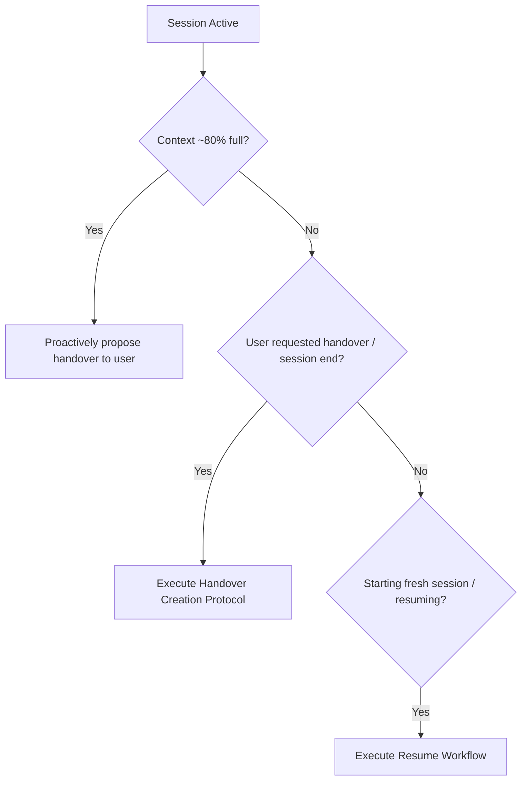

# Session Handover

## Overview

The `session-handover` skill ensures seamless continuity when transitioning between agent sessions, switching tasks, or resetting context when approaching token limits (~80% context utilization).

### Core Principle: Zero Duplication of Persistent Knowledge
- **DO NOT** duplicate persistent project knowledge already recorded in `wiki/`, `SPEC.md`, `AGENTS.md`, or committed source code.
- **DO NOT** dump large blocks of source code into handover files. Use clickable markdown links `[filename](file:///...)` instead.
- **CAPTURE ONLY** ephemeral session knowledge: active train of thought, decisions made in chat, rejected alternatives and their rationale, git branch/worktree context, unresolved blockers, and immediate next steps.
- **LANGUAGE:** All handover markdown files written to `handovers/` MUST be written in **English**.

---

## When to Use



### Proactive Trigger (80% Context Limit)
When token usage approaches ~80% of the context window, prompt degradation and context loss become imminent. Proactively notify the user:
> *"Context window is at ~80%. I recommend creating a session handover now so we can continue with a fresh, clean context without losing any unpersisted decisions or next steps."*

### Explicit Triggers
- User asks for a handover (e.g. *"create a handover"*, *"wrap up session"*, *"handover for next session"*).
- Switching between major feature tasks in a long session.
- Pausing work before an extended break.

---

## Handover Creation Protocol

Follow these steps to produce a concise, high-signal handover document:

### Step 1: Filter & Extract Session Delta
Compare session history against committed code and `wiki/`:
1. **Exclude** anything committed, tested, or already documented in `wiki/`.
2. **Extract** active train of thought and uncommitted mental context.
3. **Extract** decisions agreed upon in chat and why specific alternatives were discarded.
4. **Identify** active git branch and worktree directory.
5. **Identify** any open questions, test failures, or subtle blockers encountered.
6. **Formulate** a prioritized checklist of immediate next steps.

### Step 2: Determine Handover File Path
- Directory: `handovers/` (workspace root).
- Filename: `handovers/YYYY-MM-DD-HHmm-<slug>.md`
  - Example: `handovers/2026-08-28-1930-csharp-migration-step2.md`
- Always use the current date and 24-hour time (`HHmm`) with a short kebab-case description.

### Step 3: Write Handover Document (English)
Use the standard template below.

---

## Handover Template

```markdown
# Session Handover: <Concise Descriptive Title>

**Date & Time:** YYYY-MM-DD HH:mm  
**Branch / Worktree:** `<branch-name>` (Worktree: `<path-or-main>`)  
**Status:** In Progress / Ready for Review / Blocked  
**Touched Files:** [file1](file:///...), [file2](file:///...) (clickable links only, no code dumps)

---

## 1. Focus & Active Context
- What specific goal was being pursued when this session ended?
- What was the active train of thought / mental model?

## 2. Key Decisions & Rejected Alternatives
- **Decisions Made:** Technical choices agreed upon during the session.
- **Rejected Alternatives & Rationale:** What options were discussed and discarded, and why (prevents the next agent from retrying dead ends).

## 3. Current State & Blockers
- Exact status of in-flight work (e.g., classes written, tests pending).
- Any observed blockers, failing tests, or unresolved edge cases.

## 4. Next Steps (Checklist)
- [ ] 1. Immediate first action for the fresh session
- [ ] 2. Subsequent task ...
```

---

## Resume Workflow (Starting Fresh Session)

When opening a new session or asked to resume:

1. **Locate Latest Handover:** Inspect `handovers/` and read the most recent handover file.
2. **Verify Branch & Worktree:** Run `git branch --show-current` (and check worktree status) to ensure the environment matches the handover's `Branch / Worktree` header.
3. **Check Status Delta:** Run `git status --short` to see uncommitted changes or verify the current state against Section 3 ("Current State & Blockers").
4. **Propose Step 1:** Present the first unchecked item from Section 4 ("Next Steps") to the user and request confirmation to proceed.

---

## Common Mistakes & Red Flags

| Red Flag / Rationalization | Rule & Reality |
|---|---|
| *"I will copy modified code blocks into the handover document."* | **Forbidden.** Code lives in the repo. Use clickable links `[filename](file:///...)`. |
| *"I should re-explain wiki concepts in the handover."* | **Forbidden.** Wiki is permanent; handover is for ephemeral chat context only. |
| *"Context is at 80%, but I'll finish this multi-step task first."* | **Proactive handover required.** Proactively propose handover before quality degrades. |
| *"I'll overwrite the existing handover file."* | **Forbidden.** Always create a new timestamped file (`YYYY-MM-DD-HHmm-<slug>.md`). |
| *"Writing the handover in German."* | **Forbidden.** Handover files in `handovers/` must always be in English. |
